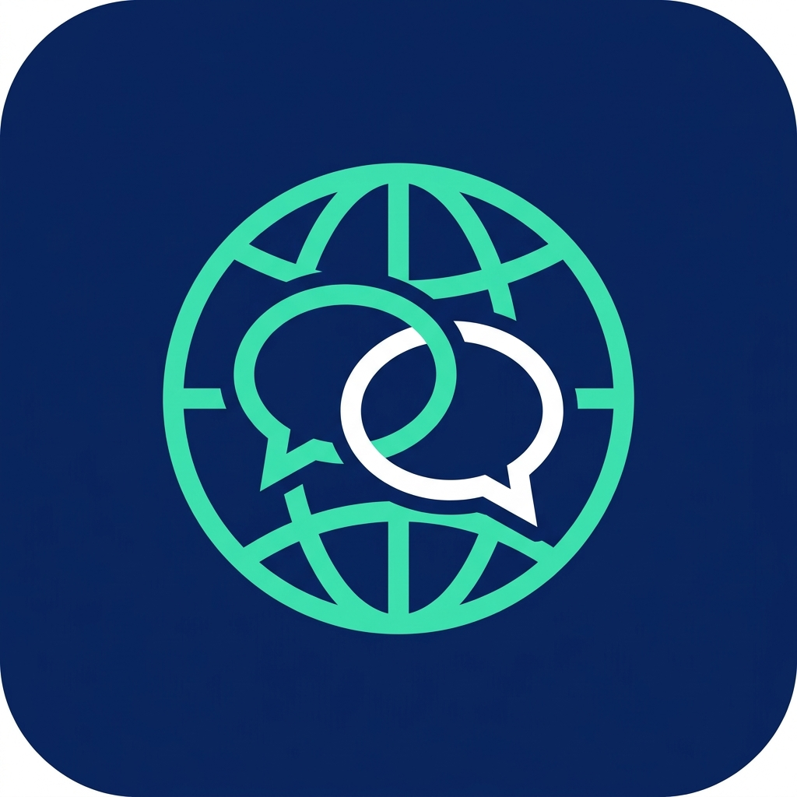

<p align="center">
  
</p>

<h1 align="center">Parlex</h1>

<p align="center">
  <strong>Офлайн AI-переводчик для Android</strong><br>
  <sub>33 языка • 1 056 направлений • 100% без интернета • Двунаправленный голосовой диалог</sub>
</p>

<p align="center">
  <a href="#"></a>
  <a href="#"></a>
  <a href="#"></a>
  <a href="LICENSE"></a>
  <a href="#"></a>
</p>

<p align="center">
  <a href="#"></a>
  <a href="#"></a>
  <a href="#"></a>
  <a href="#"></a>
  <a href="#"></a>
</p>

---

## ✨ Возможности

| | Функция | Описание |
|:--|:--|:--|
| 🌍 | **33 языка** | Все комбинации — 1 056 направлений перевода |
| ⚡ | **Быстро** | ~1 сек на предложение (Snapdragon 865+) |
| 🔒 | **Офлайн** | Нет сети — нет утечки данных |
| 🎙️ | **Голосовой диалог** | Двунаправленный: говорите на любом из двух языков — приложение автоматически определяет и переводит |
| 🔊 | **Озвучка** | Перевод читается вслух (System TTS) |
| 📝 | **История** | Полная история переводов с поиском, фильтрами и избранным |
| ⭐ | **Избранное** | Отмечай важные переводы для быстрого доступа |
| 📦 | **Менеджер моделей** | 2 семейства моделей: Tencent Hy-MT (12 квантизаций) + Google TranslateGemma (5 квантизаций) |
| ⚙️ | **Настройки** | Потоки CPU, бэкенд, авто-выгрузка модели |

---

## 🏗️ Архитектура

```
┌─────────────────────────────────────────────────┐
│                   Parlex App                    │
├──────────┬──────────┬───────────┬───────────────┤
│  Text UI │ Voice UI │ History   │ Model Manager │
│ Compose  │ Compose  │ Room DB   │ Download +    │
│          │          │ Search    │ GGUF select   │
├──────────┴──────────┴───────────┴───────────────┤
│              ViewModels (Hilt DI)               │
├─────────────────────────────────────────────────┤
│            Translation Engine (JNI)             │
│     ┌──────────┐  ┌──────────┐  ┌───────────┐  │
│     │ llama.cpp│  │Whisper   │  │System TTS │  │
│     │ (GGUF)   │  │(STT/VAD) │  │(Android)  │  │
│     └──────────┘  └──────────┘  └───────────┘  │
├─────────────────────────────────────────────────┤
│      ARM NEON (arm64-v8a) • Flash Attention     │
└─────────────────────────────────────────────────┘
```

---

## 🛠️ Технологии

| Компонент | Технология |
|:--|:--|
| **UI** | Kotlin + Jetpack Compose (Material 3, Dynamic Color) |
| **Навигация** | 4 вкладки: Текст · Диалог · Модели · Настройки |
| **Перевод** | [llama.cpp](https://github.com/ggerganov/llama.cpp) — GGUF модели через JNI |
| **Модели** | [Tencent Hy-MT 1.5 1.8B](https://huggingface.co/tencent/Hy-MT1.5-1.8B) + [Google TranslateGemma 4B](https://huggingface.co/google/translate-gemma-4b-it) |
| **Распознавание речи** | Whisper Tiny (Sherpa-ONNX) + Silero VAD v5 |
| **Синтез речи** | Android System TTS |
| **Хранение** | Room DB — история, сессии, избранное |
| **DI** | Dagger Hilt |
| **Сборка** | Gradle 8.11 + CMake 3.14 + NDK r27d LTS |

### Нативный стек

| Параметр | Значение |
|:--|:--|
| **Sampling** | Official HY-MT: temp=0.7, top_k=20, top_p=0.6, rep_penalty=1.05 |
| **Flash Attention** | ✅ Включён |
| **mmap** | ✅ Включён |
| **OpenMP** | ❌ Отключён (pthreads, стабильнее на Android) |
| **Thread clamp** | Автоматический к performance cores |

---

## 📦 Модели перевода

### Tencent Hy-MT 1.5 1.8B — 33 языка

| Квантизация | Размер | RAM | Качество |
|:--|:--|:--|:--|
| 2-bit (Tencent) | 574 МБ | ~1 ГБ | ★★☆☆☆ |
| Q2_K | ~680 МБ | ~1.1 ГБ | ★★☆☆☆ |
| IQ3_XS | ~750 МБ | ~1.2 ГБ | ★★★☆☆ |
| IQ3_M | ~800 МБ | ~1.3 ГБ | ★★★☆☆ |
| Q3_K_M | ~850 МБ | ~1.3 ГБ | ★★★☆☆ |
| IQ4_XS | ~930 МБ | ~1.4 ГБ | ★★★★☆ |
| **Q4_K_M** | **~1.0 ГБ** | **~1.5 ГБ** | **★★★★☆ рекомендуется** |
| Q5_K_M | ~1.2 ГБ | ~1.7 ГБ | ★★★★☆ |
| Q6_K | ~1.4 ГБ | ~1.9 ГБ | ★★★★★ |
| Q8_0 | ~1.9 ГБ | ~2.4 ГБ | ★★★★★ |
| F16 | ~3.6 ГБ | ~4.1 ГБ | ★★★★★ |
| BF16 | ~3.6 ГБ | ~4.1 ГБ | ★★★★★ |

### Google TranslateGemma 4B — 5 вариантов

Специализированная модель перевода от Google (Gemma 3 architecture).

---

## 🌐 Поддерживаемые языки

<details>
<summary><strong>33 языка (нажми чтобы раскрыть)</strong></summary>

| | Язык | Код |
|:--|:--|:--|
| 🇬🇧 | English | `en` |
| 🇷🇺 | Русский | `ru` |
| 🇨🇳 | 中文 (简体) | `zh` |
| 🇹🇼 | 中文 (繁體) | `zh-TW` |
| 🇯🇵 | 日本語 | `ja` |
| 🇰🇷 | 한국어 | `ko` |
| 🇫🇷 | Français | `fr` |
| 🇩🇪 | Deutsch | `de` |
| 🇪🇸 | Español | `es` |
| 🇵🇹 | Português | `pt` |
| 🇮🇹 | Italiano | `it` |
| 🇳🇱 | Nederlands | `nl` |
| 🇵🇱 | Polski | `pl` |
| 🇨🇿 | Čeština | `cs` |
| 🇹🇷 | Türkçe | `tr` |
| 🇺🇦 | Українська | `uk` |
| 🇲🇲 | မြန်မာ | `my` |
| 🇮🇳 | हिन्दी | `hi` |
| 🇧🇩 | বাংলা | `bn` |
| 🇮🇳 | ગુજરાતી | `gu` |
| 🇮🇳 | मराठी | `mr` |
| 🇮🇳 | தமிழ் | `ta` |
| 🇮🇳 | తెలుగు | `te` |
| 🇵🇰 | اردو | `ur` |
| 🇮🇷 | فارسی | `fa` |
| 🇮🇱 | עברית | `he` |
| 🇸🇦 | العربية | `ar` |
| 🇹🇭 | ไทย | `th` |
| 🇻🇳 | Tiếng Việt | `vi` |
| 🇮🇩 | Bahasa Indonesia | `id` |
| 🇲🇾 | Bahasa Melayu | `ms` |
| 🇵🇭 | Filipino | `fil` |
| 🇰🇭 | ភាសាខ្មែរ | `km` |

**+ 5 диалектов:** кантонский, хоккиен, тибетский, монгольский, уйгурский

</details>

---

## 🚀 Быстрый старт

### Требования

- Android Studio Ladybug 2024.2+
- Android SDK 35 + NDK r27d (27.3.13750724)
- CMake 3.14+
- Устройство: `arm64-v8a`, Android 8.0+ (API 26)

### 1. Клонирование

```bash
git clone https://github.com/RandoTeam/Parlex.git
cd Parlex
```

### 2. Подключение нативных движков

```bash
# llama.cpp (перевод)
cd app/src/main/cpp
git clone --depth 1 https://github.com/ggerganov/llama.cpp.git
cd ../../../..
```

### 3. Сборка

```bash
./gradlew assembleRelease
```

### 4. Установка

```bash
adb install -r app/build/outputs/apk/release/app-release.apk
```

> **Примечание:** Модели скачиваются внутри приложения через встроенный менеджер моделей.

---

## 📱 Экраны приложения

| Экран | Описание |
|:--|:--|
| **Текст** | Ввод текста → мгновенный офлайн-перевод с кнопкой озвучки |
| **Диалог** | Двунаправленный голосовой режим: говорите на любом из двух выбранных языков |
| **Модели** | Скачивание, выбор и удаление моделей (HY-MT + TranslateGemma) |
| **Настройки** | CPU потоки (1-8), бэкенд, таймаут авто-выгрузки |

---

## 📂 Структура проекта

```
app/src/main/
├── kotlin/com/translive/app/
│   ├── data/
│   │   ├── db/              # Room Database + DAO
│   │   ├── model/           # Entities, ModelVariant, Language
│   │   ├── ModelRepository   # Active model management
│   │   └── SettingsRepository # SharedPreferences
│   ├── di/                  # Hilt DI module
│   ├── engine/
│   │   ├── TranslationEngine # JNI → llama.cpp (official HY-MT params)
│   │   ├── SpeechEngine      # Whisper + Silero VAD (auto-detect)
│   │   ├── SystemTtsEngine   # Android System TTS
│   │   └── ModelDownloadManager
│   └── ui/
│       ├── screens/         # Compose screens
│       ├── viewmodel/       # ViewModels
│       ├── components/      # LanguagePicker, etc.
│       └── TransLiveNavHost # Navigation graph
├── cpp/
│   ├── translive_jni.cpp    # JNI bridge (sampling, chat template)
│   ├── CMakeLists.txt       # NDK r27d, Flash Attention, OpenMP off
│   └── llama.cpp/           # git submodule (не в репозитории)
└── res/
    ├── mipmap-*/            # App icons
    ├── drawable/            # Splash screen
    └── values/              # Themes, strings
```

---

## 🔧 Конфигурация

Настройки доступны прямо в приложении:

| Параметр | Значения | По умолчанию |
|:--|:--|:--|
| CPU потоки | 1, 2, 4, 6, 8 | 4 |
| Бэкенд | CPU / GPU (скоро) / NPU (скоро) | CPU |
| Авто-выгрузка | Выкл, 1, 2, 5, 10, 30 мин | 5 мин |

---

## 📄 Лицензия

**Код приложения** — [MIT License](LICENSE)

**Модель перевода** — [Tencent HY Community License](https://huggingface.co/tencent/Hy-MT1.5-1.8B-2bit-GGUF).  
Модель **не включена** в репозиторий. Пользователь должен скачать её самостоятельно и принять лицензию модели.

> ⚠️ Лицензия модели Tencent **не покрывает** ЕС, Великобританию и Южную Корею.

---

## 👨‍💻 Автор

**Ilia Vlasov** — [@RandoTeam](https://github.com/RandoTeam)

---

<p align="center">
  <sub>Made with ❤️ and llama.cpp</sub>
</p>
